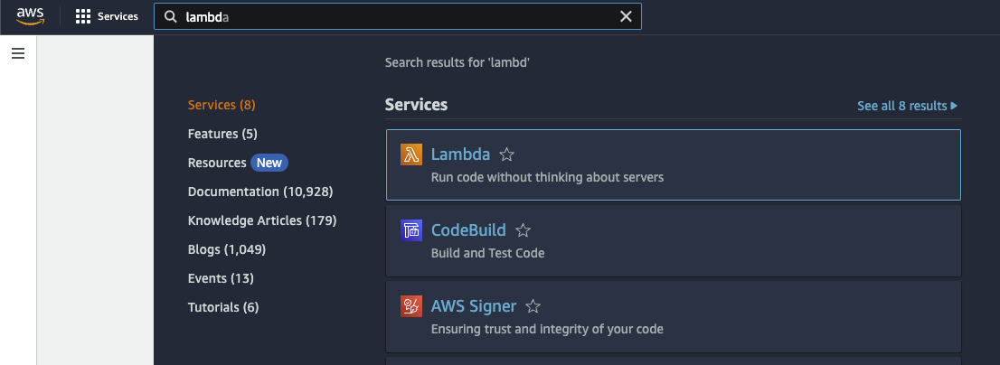
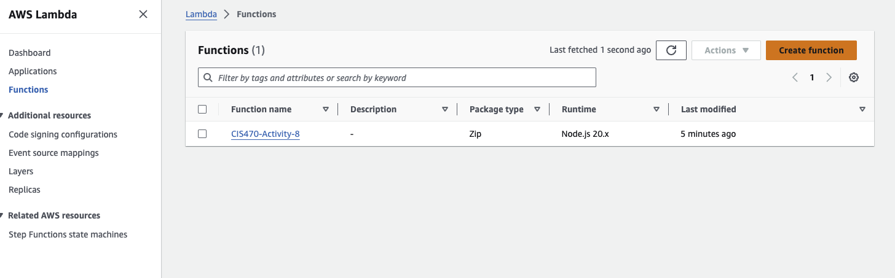
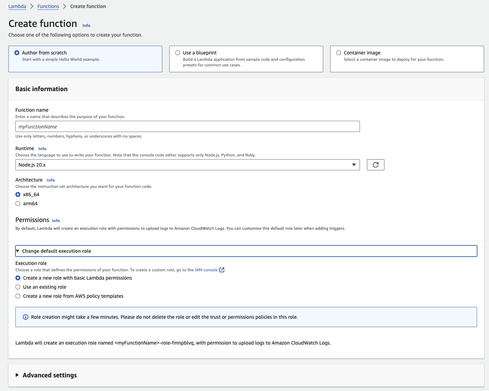
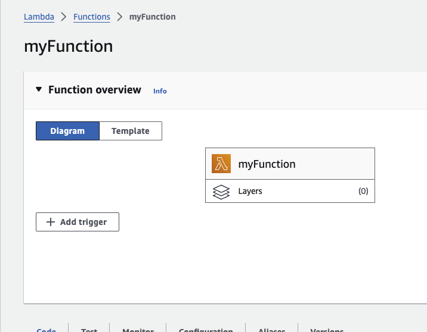
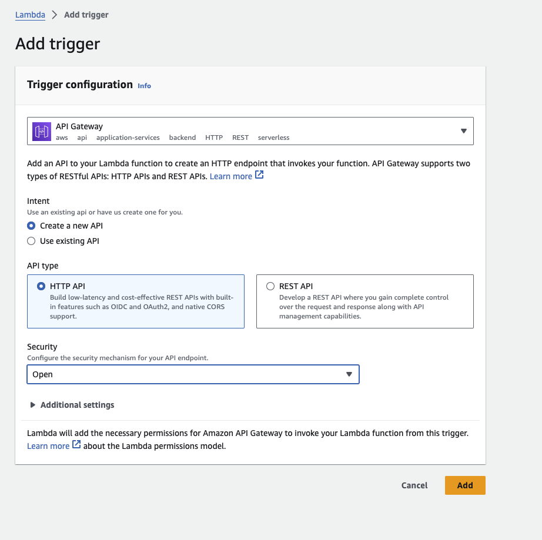

### CIS470-Activity-8 (CI/CD pipeline - Part 1)

### Basics of CI/CD pipeline, Deploying Lambda function
Running version: https://2uwhs0bpgj.execute-api.us-east-1.amazonaws.com/default/CIS470-Activity-8

### Activity Objectives

Experiment with the use of AWS Lambda functions, and deploy them to AWS Lambda.
Run a CI/CD pipeline to deploy your Lambda function to AWS Lambda.

### Activity Details

##### Create a GitHub repository
You can fork the repository [here](https://github.com/umassd-dataviz/CIS470-Activity-8) and create a new repository. or You can start your repository.

#### Open an AWS account
You will need to go to the AWS console and create an account: https://aws.amazon.com/free
Note that Lambda  is free.

#### Create an AWS Lambda function
Create a new Lambda function in your AWS account. The Lambda function name should be `CIS470-Activity-8`.
1. In the AWS console, click **Lambda** in the navigation pane.

2. Click **Create Function**.

3. Enter the name of the function as `CIS470-Activity-8`, and follow the steps.

4. Click **Next**.

Now you should see a new Lambda function. The missing part is the code and the trigger.
Add a new trigger.

5. In the trigger section, select **AWS API Gateway** and click **Next** (refer to the attached screenshot).

##### Having set the API and made the Lambda function, you can now deploy it to Lambda.
In order to deploy to Lambda, you need to  have the access key and the secret key.
Check the video below to see how you can make the access key and secret key. Also, follow the video steps to add the keys to your GitHub repository secret keys.

https://github.com/umassd-dataviz/CIS470-Activity-8/assets/119906645/8ca7d3a7-d2e6-4764-b124-2b2c1eb7a775

#### Deliverables of the Assignment:

Running lambda function in AWS Lambda: Include the link to the running lambda function.

<i> In the next Activity, we will use this lambda function to add test, and run it. </i>
